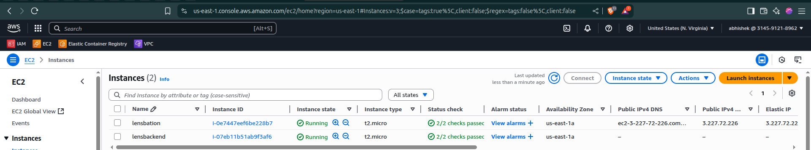
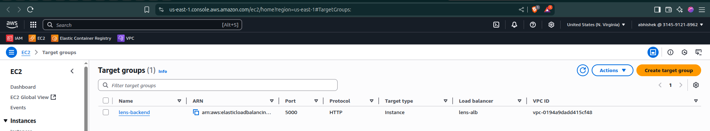
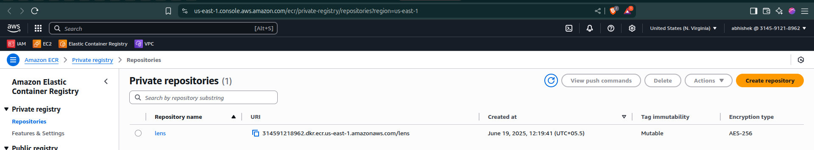
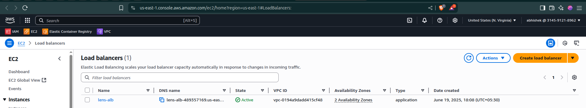
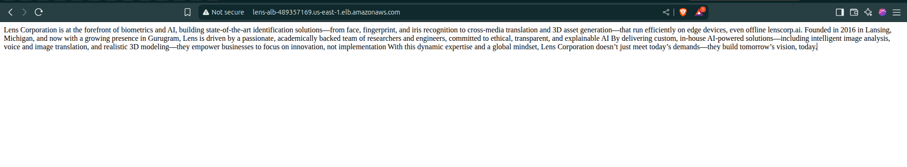

---

# 📦 lens-devops-assignment

This project demonstrates a **complete end-to-end DevOps workflow** for deploying a dummy **Flask** application on **AWS** using best practices for **Infrastructure as Code (Terraform)**, **Containerization (Docker & ECR)**, **Secure Deployment (Bastion Host & Private Backend)**, and **Continuous Integration/Deployment (GitHub Actions)**.

The application runs in a **private EC2 instance**, accessed securely through an **Application Load Balancer (ALB)**, with traffic routed via a target group listening on port 5000.

---

## ✅ **Key Components**

| Service                                    | Purpose                                           |
| ------------------------------------------ | ------------------------------------------------- |
| **EC2 Bastion Host (`lensbation`)**        | Publicly accessible jump server for SSH tunneling |
| **EC2 Backend Server (`lensbackend`)**     | Private instance running the Flask app            |
| **Elastic Container Registry (`lens`)**    | Private Docker image repository                   |
| **Target Group (`lens-backend`)**          | Routes ALB traffic to backend server on port 5000 |
| **Application Load Balancer (`lens-alb`)** | Exposes the backend to the internet securely      |
| **GitHub Actions CI/CD**                   | Automates build, push, and deployment via Bastion |

---

## 🗂️ **Project Structure**

```
lens-devops-assignment/
├── application/               # Flask app & Docker config
│   ├── app.py
│   ├── Dockerfile
│   ├── docker-compose.yml
│   └── requirements.txt
├── infra/                     # Infrastructure as Code (Terraform)
│   ├── DEV/                   # Dev environment config
│   │   ├── ec2_instances/
│   │   ├── ecr/
│   │   ├── security_group/
│   │   └── vpc/
│   └── MODULES/               # Reusable modules
│       ├── ec2_instances/
│       ├── ecr/
│       ├── security_group/
│       └── vpc/
├── .github/workflows/         # CI/CD pipeline
│   └── main.yml
└── README.md                  # Documentation
```

---

## 🚀 **Workflow Overview**

1️⃣ **Infrastructure Provisioning**

* All AWS resources are provisioned with Terraform:

  * VPC, subnets, EC2 Bastion & Backend instances.
  * ECR private repository.
  * Security groups for Bastion, Backend, and ALB.
  * ALB with listener and target group on port 5000.

2️⃣ **Container Build & Push**

* GitHub Actions builds the Flask Docker image.
* Pushes the image to ECR.

3️⃣ **Deployment via Bastion**

* SSH connects to the Bastion Host.
* From Bastion, connects to Backend server.
* Logs into ECR, pulls latest image.
* Stops old container, runs new one on port 5000.
* ALB forwards requests to the target group → Backend.

4️⃣ **Public Access**

* The app is publicly reachable at the ALB DNS URL.

---

## ⚙️ **GitHub Actions: `main.yml`**

Below is a breakdown of your workflow:

```yaml
name: CI/CD with Bastion and ECR

on:
  push:
    branches: [main]

jobs:
  build-and-deploy:
    runs-on: ubuntu-latest
    environment: lens

    steps:
    - name: Checkout code
      uses: actions/checkout@v3

    - name: Set up Docker Buildx
      uses: docker/setup-buildx-action@v3

    - name: Configure AWS credentials
      uses: aws-actions/configure-aws-credentials@v2
      with:
        aws-access-key-id: ${{ secrets.AWS_ACCESS_KEY_ID }}
        aws-secret-access-key: ${{ secrets.AWS_SECRET_ACCESS_KEY }}
        aws-region: ${{ secrets.AWS_REGION }}

    - name: Login to Amazon ECR
      id: login-ecr
      uses: aws-actions/amazon-ecr-login@v1

    - name: Build Docker image
      run: |
        docker build -t ${{ secrets.ECR_REPO }}:latest -f application/Dockerfile application

    - name: Push Docker image to ECR
      run: |
        docker push ${{ secrets.ECR_REPO }}:latest

    - name: Deploy via Bastion Host
      uses: appleboy/ssh-action@v1.0.0
      with:
        host: ${{ secrets.EC2_BACKEND }}
        username: ${{ secrets.EC2_USER }}
        key: ${{ secrets.EC2_SSH_KEY }}
        proxy_host: ${{ secrets.EC2_BASTION }}
        proxy_username: ${{ secrets.EC2_USER }}
        proxy_key: ${{ secrets.EC2_SSH_KEY }}
        script: |
          echo "Logging into ECR from EC2..."
          docker login -u AWS -p $(aws ecr get-login-password --region ${{ secrets.AWS_REGION }}) ${{ secrets.ECR_REPO }}

          echo "Pulling latest image..."
          docker pull ${{ secrets.ECR_REPO }}:latest

          echo "Stopping existing container..."
          docker stop app || true
          docker rm app || true

          echo "Running container on port 5000..."
          docker run -d --name app -p 5000:5000 ${{ secrets.ECR_REPO }}:latest
```

---

## 🔐 **Required GitHub Secrets**

| Secret                  | Description                                                              |
| ----------------------- | ------------------------------------------------------------------------ |
| `AWS_ACCESS_KEY_ID`     | IAM access key                                                           |
| `AWS_SECRET_ACCESS_KEY` | IAM secret                                                               |
| `AWS_REGION`            | AWS region (e.g., `us-east-1`)                                           |
| `ECR_REPO`              | Full ECR URI (e.g., `123456789012.dkr.ecr.us-east-1.amazonaws.com/lens`) |
| `EC2_USER`              | SSH username (e.g., `ec2-user` or `ubuntu`)                              |
| `EC2_BASTION`           | Public IP or DNS of Bastion host                                         |
| `EC2_BACKEND`           | Private IP of Backend host                                               |
| `EC2_SSH_KEY`           | Private SSH key to access both hosts                                     |

---

## 🔑 **How to Access the App**

✅ After deployment:

* Open your **ALB DNS URL** in your browser.
* Example: `http://lens-alb-xxxxxxx.us-east-1.elb.amazonaws.com`
* You should see your Flask application output.

---

## 📌 **Tech Used**

* **AWS EC2, ECR, VPC, Security Groups**
* **Application Load Balancer**
* **Terraform**
* **Docker & Docker Compose**
* **Python Flask**
* **GitHub Actions CI/CD**
* **Bastion host for secure access**

---

## 🎯 **Learning Goals**

* ✅ Infrastructure as Code with modular Terraform
* ✅ Secure EC2 architecture with Bastion pattern
* ✅ Private container registry and secure image delivery
* ✅ Automated CI/CD pipeline with GitHub Actions
* ✅ Secure, resilient, and scalable deployment behind ALB

---

## 📷 **Screenshots**

| Resource           | Screenshot                                      |
| ------------------ | ----------------------------------------------- |
| **EC2 Instances**  |        |
| **Target Group**   |  |
| **ECR Repository** |                    |
| **Load Balancer**  |                    |
| **Final Output**   |              |

(*Make sure to place the actual images in a `screenshots/` folder!*)

---

## ✅ **Status**

🚀 **Deployment is live and accessible via ALB.**

---

